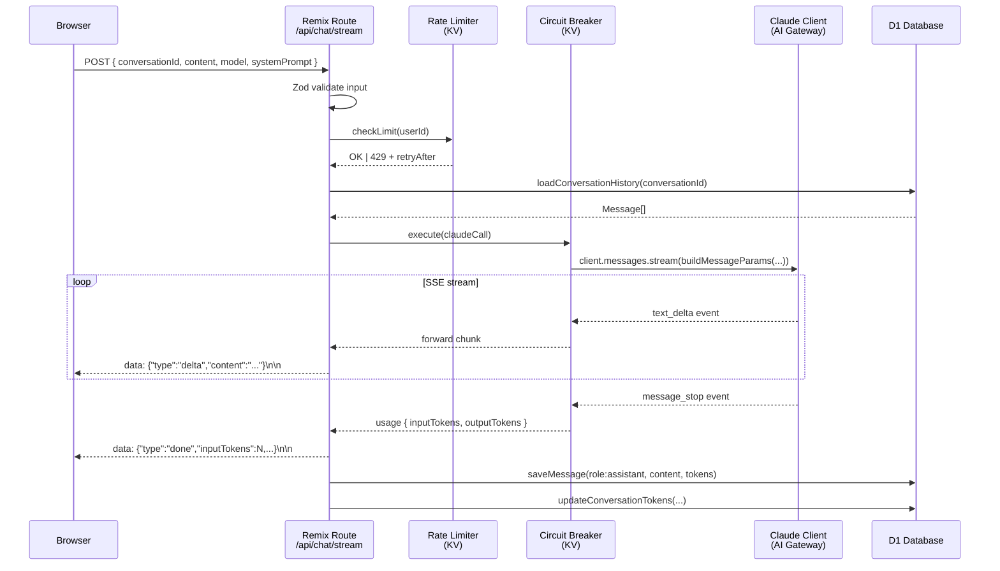
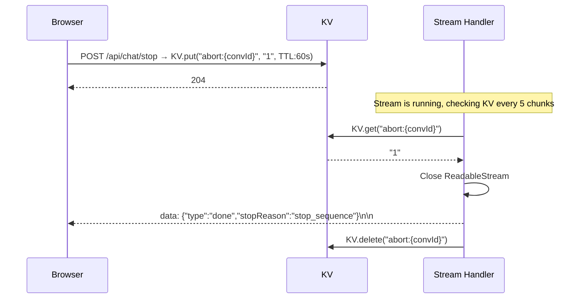
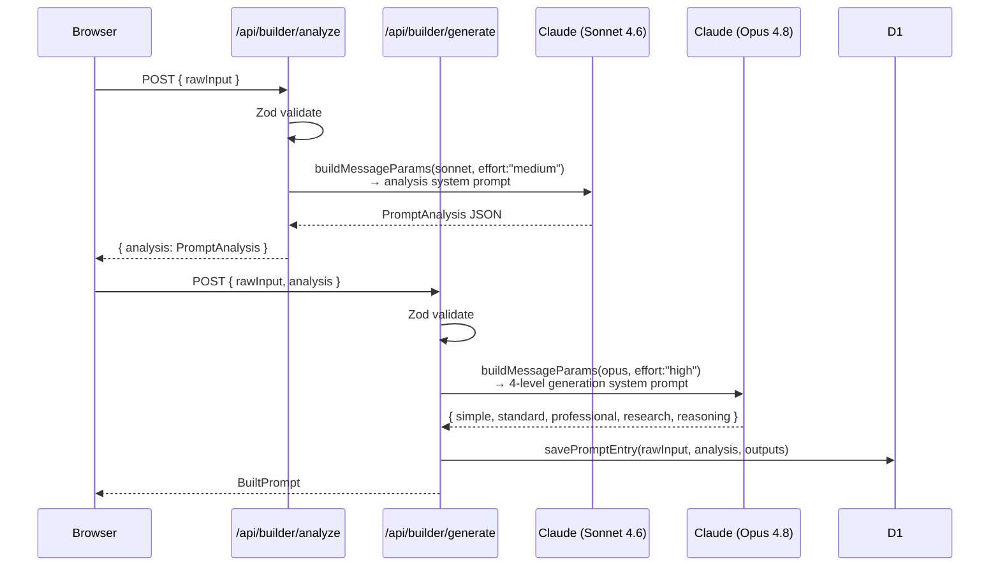
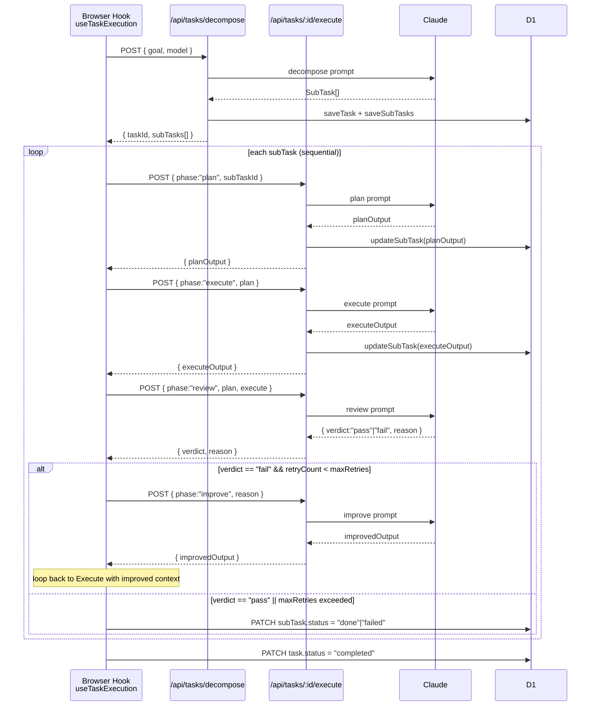

# Data Flow Diagrams

## Feature 1: Chat — Streaming Message

```mermaid
sequenceDiagram
  participant B as Browser
  participant R as Remix Route<br/>/api/chat/stream
  participant RL as Rate Limiter<br/>(KV)
  participant CB as Circuit Breaker<br/>(KV)
  participant CL as Claude Client<br/>(AI Gateway)
  participant D as D1 Database

  B->>R: POST { conversationId, content, model, systemPrompt }
  R->>R: Zod validate input

  R->>RL: checkLimit(userId)
  RL-->>R: OK | 429 + retryAfter

  R->>D: loadConversationHistory(conversationId)
  D-->>R: Message[]

  R->>CB: execute(claudeCall)
  CB->>CL: client.messages.stream(buildMessageParams(...))

  loop SSE stream
    CL-->>CB: text_delta event
    CB-->>R: forward chunk
    R-->>B: data: {"type":"delta","content":"..."}\n\n
  end

  CL-->>CB: message_stop event
  CB-->>R: usage { inputTokens, outputTokens }
  R-->>B: data: {"type":"done","inputTokens":N,...}\n\n

  R->>D: saveMessage(role:assistant, content, tokens)
  R->>D: updateConversationTokens(...)
```

## Feature 1: Chat — Abort

```mermaid
sequenceDiagram
  participant B as Browser
  participant K as KV
  participant S as Stream Handler

  B->>K: POST /api/chat/stop → KV.put("abort:{convId}", "1", TTL:60s)
  K-->>B: 204

  Note over S: Stream is running, checking KV every 5 chunks
  S->>K: KV.get("abort:{convId}")
  K-->>S: "1"
  S->>S: Close ReadableStream
  S-->>B: data: {"type":"done","stopReason":"stop_sequence"}\n\n
  S->>K: KV.delete("abort:{convId}")
```

## Feature 2: Prompt Builder — Two-Phase

```mermaid
sequenceDiagram
  participant B as Browser
  participant A as /api/builder/analyze
  participant G as /api/builder/generate
  participant CL as Claude (Sonnet 4.6)
  participant CO as Claude (Opus 4.8)
  participant D as D1

  B->>A: POST { rawInput }
  A->>A: Zod validate
  A->>CL: buildMessageParams(sonnet, effort:"medium")<br/>→ analysis system prompt
  CL-->>A: PromptAnalysis JSON
  A-->>B: { analysis: PromptAnalysis }

  B->>G: POST { rawInput, analysis }
  G->>G: Zod validate
  G->>CO: buildMessageParams(opus, effort:"high")<br/>→ 4-level generation system prompt
  CO-->>G: { simple, standard, professional, research, reasoning }
  G->>D: savePromptEntry(rawInput, analysis, outputs)
  G-->>B: BuiltPrompt
```

## Feature 3: Tasks — Execution Loop

```mermaid
sequenceDiagram
  participant B as Browser Hook<br/>useTaskExecution
  participant D as /api/tasks/decompose
  participant E as /api/tasks/:id/execute
  participant CL as Claude
  participant DB as D1

  B->>D: POST { goal, model }
  D->>CL: decompose prompt
  CL-->>D: SubTask[]
  D->>DB: saveTask + saveSubTasks
  D-->>B: { taskId, subTasks[] }

  loop each subTask (sequential)
    B->>E: POST { phase:"plan", subTaskId }
    E->>CL: plan prompt
    CL-->>E: planOutput
    E->>DB: updateSubTask(planOutput)
    E-->>B: { planOutput }

    B->>E: POST { phase:"execute", plan }
    E->>CL: execute prompt
    CL-->>E: executeOutput
    E->>DB: updateSubTask(executeOutput)
    E-->>B: { executeOutput }

    B->>E: POST { phase:"review", plan, execute }
    E->>CL: review prompt
    CL-->>E: { verdict:"pass"|"fail", reason }
    E-->>B: { verdict, reason }

    alt verdict == "fail" && retryCount < maxRetries
      B->>E: POST { phase:"improve", reason }
      E->>CL: improve prompt
      CL-->>E: improvedOutput
      E-->>B: { improvedOutput }
      Note over B: loop back to Execute with improved context
    else verdict == "pass" || maxRetries exceeded
      B->>DB: PATCH subTask.status = "done"|"failed"
    end
  end

  B->>DB: PATCH task.status = "completed"
```
