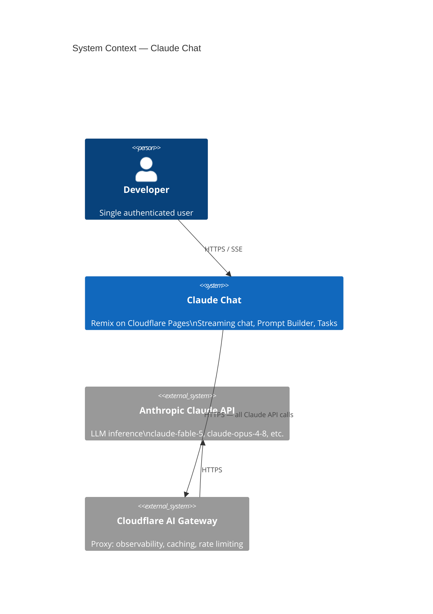
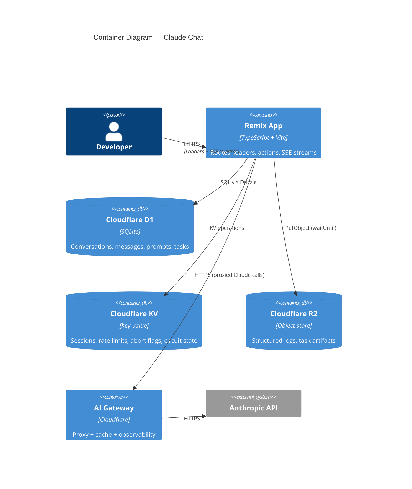

# Architecture Overview

## System Summary

Claude Chat is a single-tenant developer tool running on Cloudflare's edge network. The user's browser talks to a Remix application running as Cloudflare Pages Functions, which orchestrates Claude API calls, persists data to D1, caches hot state in KV, and writes logs to R2.

## C4 Context Diagram



## C4 Container Diagram



## Request Routing

```
Browser → Cloudflare CDN → Pages Function (Workers runtime)
  ├── GET  /*              → Remix loader (SSR)
  ├── POST /api/*          → Remix action (API route)
  └── GET  /api/*/stream   → SSE streaming response (action)
```

## Vertical Slice Architecture

```
app/
├── routes/          # Thin: validate → service → response
├── features/
│   ├── chat/        # Components, hooks, services, repos, schemas, types
│   ├── builder/     # Same structure
│   └── tasks/       # Same structure
└── shared/
    ├── components/  # Design system atoms + layout
    ├── lib/         # Claude client, DB client, KV, errors, utils
    └── types/       # Env, API, Claude types
```

**Rule:** Features never import from each other. Shared code extracted to `app/shared/` only when 3+ features need it.

## Data Store Responsibilities

| Store | Data | Why |
|-------|------|-----|
| D1 | Conversations, messages, prompts, tasks, sub-tasks, logs | Relational, queryable, durable |
| KV | Rate limit buckets, abort flags, circuit state, prompt cache | Sub-ms reads, ephemeral OK |
| R2 | Structured JSON logs, large task outputs | Cheap object storage, never query |

## Cold Start + Performance

- Workers V8 isolate: 3–8ms cold start (no container spin-up)
- SSE streaming: first token visible in < 1s (AI Gateway same PoP)
- D1 reads: ~1ms (co-located)
- KV reads: < 1ms (global replication)
