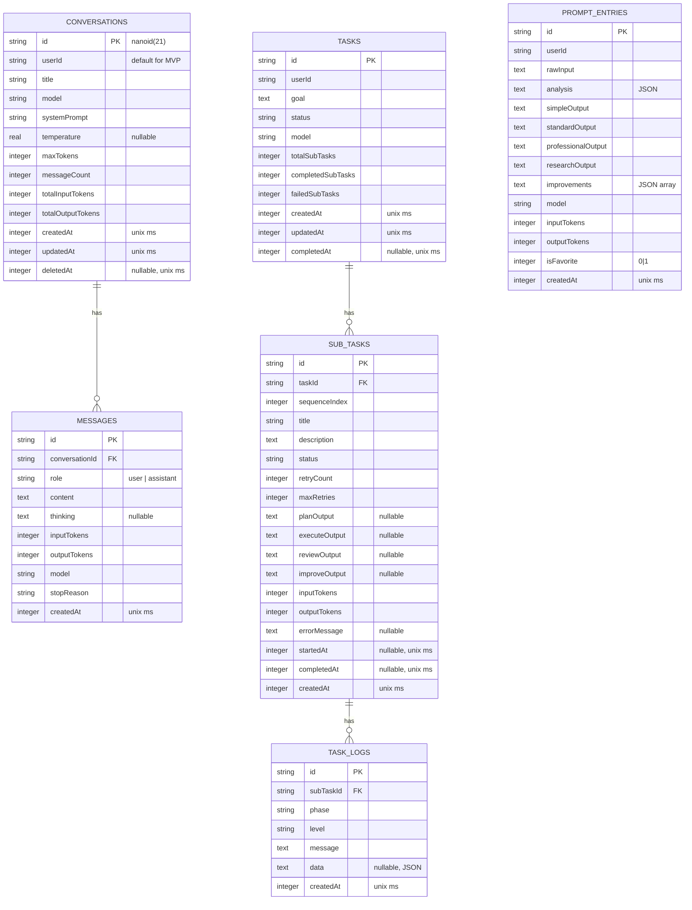

# Database Schema

## Overview

Single SQLite database on Cloudflare D1. All tables defined in `app/shared/lib/db/schema.ts` using Drizzle ORM.

## ER Diagram



## Table Details

### conversations

| Column | Type | Notes |
|--------|------|-------|
| id | TEXT PK | nanoid(21) |
| userId | TEXT | `"default"` for single-user MVP |
| title | TEXT | Auto-generated from first message |
| model | TEXT | ModelId — validated against MODEL_REGISTRY |
| systemPrompt | TEXT | Empty string if not set |
| temperature | REAL | NULL if model doesn't support it |
| maxTokens | INTEGER | Default: model's maxOutputTokens |
| messageCount | INTEGER | Denormalized for O(1) count |
| totalInputTokens | INTEGER | Running total |
| totalOutputTokens | INTEGER | Running total |
| createdAt | INTEGER | Unix ms |
| updatedAt | INTEGER | Unix ms — updated on every message |
| deletedAt | INTEGER | NULL = active, non-NULL = soft deleted |

Index: `(userId, deletedAt, updatedAt DESC)` for conversation list query.

### messages

| Column | Type | Notes |
|--------|------|-------|
| id | TEXT PK | nanoid(21) |
| conversationId | TEXT FK | → conversations.id |
| role | TEXT | `"user"` or `"assistant"` |
| content | TEXT | Full message content |
| thinking | TEXT | Extended thinking output (nullable) |
| inputTokens | INTEGER | 0 for user messages |
| outputTokens | INTEGER | 0 for user messages |
| model | TEXT | Model used (only meaningful for assistant) |
| stopReason | TEXT | `"end_turn"`, `"interrupted"`, `"refusal"`, etc. |
| createdAt | INTEGER | Unix ms |

Index: `(conversationId, createdAt ASC)` for history load.

### Timestamps Convention

All timestamps stored as `INTEGER` (unix milliseconds). Drizzle config:

```typescript
createdAt: integer("created_at", { mode: "timestamp_ms" }).notNull().$defaultFn(() => new Date()),
```

This avoids SQLite timezone bugs with TEXT timestamps and is sortable.

## Migrations

Generated by `drizzle-kit generate`. Never edit generated migration files. See `docs/database/migrations.md` for workflow.
