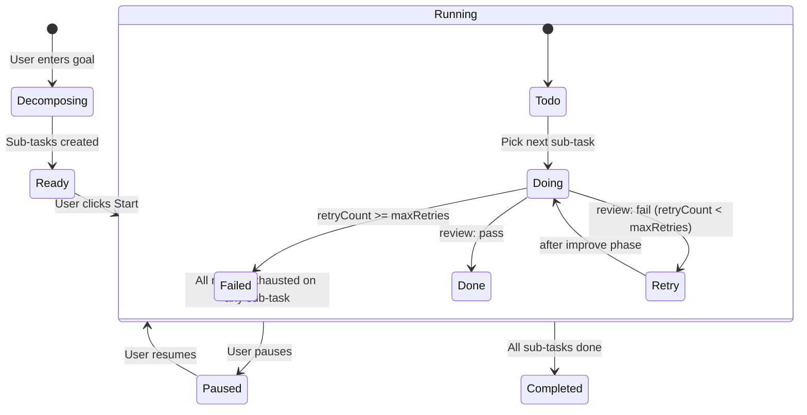

# Feature: Tasks

## Overview

Tasks decomposes a high-level goal into sequential sub-tasks, then executes each through a Plan→Execute→Review→Improve loop. Each phase is a separate Claude API call. The user can pause, resume, and inspect the output of each phase. State is persisted to D1 so refreshing the page recovers in-progress work.

## State Machine



## Execution Phases (per sub-task)

| Phase | Prompt | Output |
|-------|--------|--------|
| Plan | "Think through how to accomplish: {description}" | Step-by-step plan text |
| Execute | "Execute this plan: {plan}" | Deliverable output |
| Review | "Does this output accomplish: {description}?" | `{ verdict, reason }` |
| Improve | "Improve this output given: {reason}" | Revised output → back to Execute |

## Data Model

```typescript
type Task = {
  id: string;
  goal: string;
  status: "decomposing" | "ready" | "running" | "paused" | "completed" | "failed";
  model: ModelId;
  totalSubTasks: number;
  completedSubTasks: number;
  failedSubTasks: number;
  createdAt: Date;
  completedAt: Date | null;
};

type SubTask = {
  id: string;
  taskId: string;
  sequenceIndex: number;
  title: string;
  description: string;
  status: "todo" | "doing" | "done" | "failed" | "retry";
  retryCount: number;
  maxRetries: number;      // default: 2
  planOutput: string | null;
  executeOutput: string | null;
  reviewOutput: string | null;
  improveOutput: string | null;
  inputTokens: number;
  outputTokens: number;
  errorMessage: string | null;
  startedAt: Date | null;
  completedAt: Date | null;
};

type TaskLog = {
  id: string;
  subTaskId: string;
  phase: "plan" | "execute" | "review" | "improve" | "system";
  level: "debug" | "info" | "warn" | "error";
  message: string;
  data: Record<string, unknown> | null;
  createdAt: Date;
};
```

## API Endpoints

| Endpoint | Method | Description |
|----------|--------|-------------|
| `/api/tasks/decompose` | POST | Decompose goal into sub-tasks |
| `/api/tasks/:id/execute` | POST | Execute one phase of a sub-task |
| `/_layout.tasks.$id` | GET | Load task + sub-tasks + logs (loader) |
| `/_layout.tasks.$id` | PATCH | Pause/resume task (action) |

## UI Components

| Component | Responsibility |
|-----------|---------------|
| `TasksPanel` | Root: navigation, goal input area |
| `GoalInput` | Large textarea for goal entry + decompose button |
| `TaskList` | List of all sub-tasks with status badges |
| `TaskItem` | Single sub-task: title, status, expand to see phase outputs |
| `TaskStateIndicator` | Visual status: Todo/Doing/Done/Failed/Retry |
| `TaskLog` | Scrollable log of phase transitions |
| `TaskProgress` | Progress bar: N/total sub-tasks complete |
| `ExecutionControls` | Start/Pause/Resume/Stop buttons |

## Key Design Decisions

- **Client-side loop** — `useTaskExecution` hook in the browser drives the loop. The browser manages state, calls the API sequentially, and updates D1 after each phase. This avoids the complexity of Durable Objects in MVP.
- **Crash recovery** — because each phase output is saved to D1 immediately, refreshing the page resumes from the last completed phase. `useTaskExecution` checks sub-task status on mount.
- **Sequential, not parallel** — sub-tasks run one at a time. Later sub-tasks often depend on earlier outputs. Parallelism would require a dependency graph.
- **maxRetries = 2** — enough for genuine improvement without infinite loops. After 2 retries, sub-task is marked `failed` and execution continues with the next.
- **Pause via KV** — `KV.put("task-paused:{taskId}", "1")`. The loop checks this key before each phase API call. Server-side check means pausing works even if the browser is slow.

## v1 Upgrade Path (Durable Objects)

In v1, the client-side loop moves to a Durable Object:
- Client sends goal → receives taskId
- DO manages state machine, calls API phases, persists to D1
- Client polls `/api/tasks/:id` for status (or uses SSE)
- Tasks survive browser close
- Multiple tasks can run in parallel (each in its own DO)
